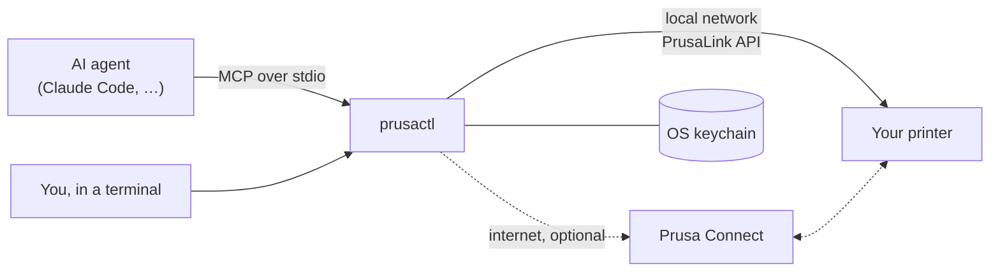

<h1 align="center">prusactl</h1>

<p align="center">
  <b>Run your Prusa 3D printer from the terminal, or hand it to an AI agent.</b><br>
  A CLI and <a href="https://modelcontextprotocol.io">MCP</a> server that talks to the printer directly on your network, and through <a href="https://connect.prusa3d.com">Prusa Connect</a> from anywhere.
</p>

<p align="center">
  <a href="https://github.com/trevin-lee/prusactl/actions/workflows/ci.yml"></a>
  
  
  <a href="LICENSE"></a>
</p>

---

`prusactl mcp` gives an agent such as Claude hands on your printer. It can:

- **Watch:** check state, temperatures, job progress, and (with Connect) the camera.
- **Print:** upload files, start them, pause, resume, stop, and queue.
- **Control:** heat, home, move, load and unload filament, and level the bed.
- **Answer the printer:** press the buttons on dialogs shown on its screen, such as
  runout or errors. Needs Connect.
- **Run G-code:** any G-code, over the direct connection.

It is one Go binary with no browser involved. Setup is two terminal prompts.

## Things you can ask

> How's the print going? Show me the camera.
>
> Print `~/Downloads/bracket.bgcode`.
>
> Preheat for PETG.
>
> Object 3 is spaghetti. Cancel just that one.
>
> The printer is showing a dialog. What does it say?
>
> What did I print this week, and how many failed?

## Quick start

```sh
go install github.com/trevin-lee/prusactl/cmd/prusactl@latest

prusactl setup 192.168.1.50    # the printer's address; asks for its PrusaLink password
prusactl status

prusactl login                 # optional: Prusa Connect, for remote access, camera, dialogs
```

The PrusaLink password is on the printer under **Settings → Network → PrusaLink**.

Add it to Claude Code:

```sh
claude mcp add --scope user prusa -- "$(go env GOPATH)/bin/prusactl" mcp
```

Any other MCP client works the same way: run `prusactl mcp` as a stdio server.

## How it works



prusactl reaches the printer two ways, and each tool picks one:

| | Direct (PrusaLink) | Prusa Connect |
|---|---|---|
| Set up with | `prusactl setup` and the password on the printer's screen | `prusactl login` with your Prusa Account |
| Reaches the printer | On your network | From anywhere |
| Status, files, upload, print, pause/resume/stop | ✅ | ✅ |
| Heat, move, filament, leveling | ✅ via `run_gcode` (printer idle) | ✅ via firmware commands |
| Any G-code | ✅ | ❌ |
| Camera, on-screen dialogs, queue, history, events | ❌ | ✅ |

The direct route is used whenever the printer answers. Otherwise, or for
Connect-only features, the tool goes through Connect. Every result says which
route it used.

### Signing in to Prusa Connect

`prusactl login` asks for your Prusa Account email and password, plus a 2FA
code if your account has one. It fills in Prusa's own login page over HTTPS the
same way a browser would. It then trades the resulting code for tokens, using
the OAuth + PKCE flow of the Connect web app.

- **Your password** is sent only to account.prusa3d.com and is never stored.
- **Where tokens are kept:** the OS keychain (macOS Keychain, Secret Service, or
  Windows Credential Manager), under the service `prusactl`. A machine without
  one, such as a headless Raspberry Pi, gets `secrets.json` in prusactl's config
  directory instead, readable only by you; `PRUSACTL_KEYRING=file` forces that.
- **Staying signed in:** tokens refresh on their own. Prusa rotates refresh
  tokens, so refreshes are coordinated between processes. Several agents can
  share one session without signing each other out.
- **Google or Apple sign-in** accounts need a Prusa Account password set before
  this works.

The printer's PrusaLink password is kept in the same keychain.

## MCP tools

| Tool | Route | What it does |
| --- | --- | --- |
| `connection_status` | both | How the printer can be reached right now, and what to set up |
| `list_printers`, `get_printer` | both | State, temperatures, job progress, and (via Connect) any dialog on screen |
| `list_printer_files`, `delete_printer_files` | both | Browse or clean up the printer's storage |
| `download_printer_file` | direct | Copy a file from the printer to this computer, e.g. to check the slicer settings a print used |
| `upload_file` | both | Send a local `.bgcode`/`.gcode` to the printer, and optionally start or queue it |
| `start_print` | both | Print a file already on the printer |
| `control_print` | both | Pause, resume, continue, or stop |
| `get_transfers` | both | File transfers in progress |
| `run_gcode` | direct | Run G-code, such as heating, homing, moving, or filament changes, while the printer is idle |
| `get_camera_snapshot` | Connect | Latest camera image, with how old it is |
| `respond_to_dialog` | Connect | Press a button on the printer's screen |
| `list_supported_commands`, `send_command`, `get_command` | Connect | Every firmware command Connect exposes, with arguments and allowed states |
| `get_queue`, `add_to_queue`, `remove_from_queue` | Connect | The print queue |
| `list_jobs`, `get_job` | Connect | Print history, and the objects in a job that can be cancelled |
| `get_telemetry`, `list_events` | Connect | Telemetry history and the event log |
| `list_connect_files` | Connect | Connect cloud storage |
| `api_request` | both | Any other endpoint: `/api/...` goes to the printer, `/app/...` to Connect |

Every `printer` argument accepts a name, serial number, or Connect UUID. With one
printer you can leave it out. `via: "direct"` or `via: "connect"` forces a route.

## CLI

```text
prusactl setup [ADDRESS]           connect directly to the printer on your network
prusactl login                     optional: sign in to Prusa Connect
prusactl logout                    forget the Prusa Connect session
prusactl status                    printer state and how it is reachable
prusactl mcp                       run the MCP server on stdio
prusactl download PATH [DEST]      copy a file from the printer to this computer
prusactl api [METHOD] PATH [JSON]  /api/... to the printer, /app/... to Prusa Connect
```

`prusactl setup --forget` removes the saved printer. `--api-key` uses a PrusaLink
API key instead of the password, and `--password-stdin` reads the secret from a
pipe.

`prusactl api` masks API keys and tokens in responses (Connect's printer record
carries the PrusaLink and Connect keys), so its output is safe to paste or hand
to an agent. `--raw` shows them.

## Limits

- **It has no hands.** It can't clear the build plate, swap a spool, or fix a
  clog. The tool descriptions tell the agent to check the printer (and the camera,
  if any) before starting a print or moving anything. Tools that start a job
  refuse a busy printer, and after a finished or stopped print they also need
  `plate_clear: true`, since the last part may still be on the plate.
- **`run_gcode` runs as a tiny print job.** So it only works while the printer is
  idle, and it shows up in the printer's history.
- **Connect's API is unofficial.** Prusa doesn't publish it; prusactl uses the
  same endpoints as connect.prusa3d.com, so a change on Prusa's side can break the
  Connect route. The direct route uses Prusa's documented
  [PrusaLink API](https://github.com/prusa3d/Prusa-Link-Web/blob/master/spec/openapi.yaml).

## Configuration

| Variable | Purpose |
| --- | --- |
| `PRUSACTL_HOST`, `PRUSACTL_USER`, `PRUSACTL_AUTH` | Override the saved printer address, username, or `digest`/`api-key` |
| `PRUSACTL_PASSWORD`, `PRUSACTL_API_KEY` | Supply the printer secret instead of the keychain |
| `PRUSACTL_KEYRING=file` | Keep credentials in `secrets.json` (mode 0600) instead of the OS keychain |
| `PRUSACTL_CONFIG` | Alternate config file (default: `prusactl/config.json` in the OS config dir) |
| `PRUSA_CONNECT_URL`, `PRUSA_ACCOUNT_URL` | Connect and Prusa Account origins |
| `PRUSA_CLIENT_ID`, `PRUSA_REDIRECT_URI` | The OAuth client (default: the Connect web app's) |

## Development

```sh
go test ./...
go vet ./...
```

Releases are cut by pushing a `vX.Y.Z` tag. CI builds the binaries, updates the
Homebrew tap, attaches the MCP bundle, and publishes to the MCP Registry. See
[CHANGELOG.md](CHANGELOG.md).

## License

[MIT](LICENSE).

prusactl is an independent project. It is not affiliated with or endorsed by
Prusa Research. Prusa and Prusa Connect are trademarks of Prusa Research a.s.
