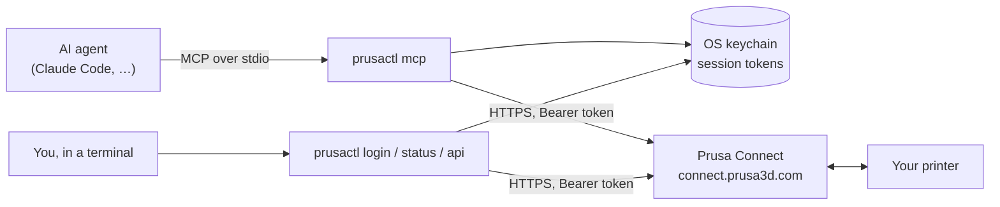
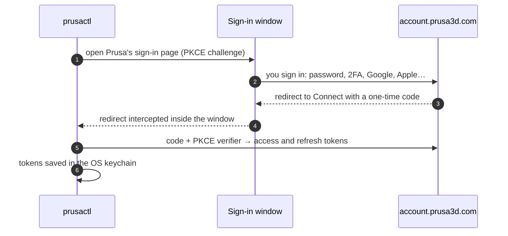

<h1 align="center">prusactl</h1>

<p align="center">
  <b>Run your Prusa 3D printer from the terminal, or hand it to an AI agent.</b><br>
  A CLI and <a href="https://modelcontextprotocol.io">MCP</a> server for <a href="https://connect.prusa3d.com">Prusa Connect</a>.
</p>

<p align="center">
  <a href="https://github.com/trevin-lee/prusactl/actions/workflows/ci.yml"></a>
  
  
  <a href="LICENSE"></a>
</p>

---

`prusactl mcp` gives an agent such as Claude the same reach you have in the Connect
web app. It can:

- **Watch:** check state, temperatures, job progress and the camera.
- **Print:** upload files, start them, queue them, pause, resume and stop.
- **Control:** home, move axes, set temperatures, speed and flow, load and unload
  filament, and run mesh bed leveling.
- **Answer the printer:** press the buttons on dialogs shown on its screen, such as
  runout or errors.
- **Everything else:** run any other command the printer's firmware accepts through Connect.

It is one Go binary. It talks only to Prusa Connect, so it works wherever you are,
not just on your home network.

## Things you can ask

> How's the print going? Show me the camera.
>
> When this finishes, print `~/Downloads/bracket.bgcode` next.
>
> Preheat for PETG.
>
> Object 3 is spaghetti. Cancel just that one.
>
> The printer is showing a dialog. What does it say?
>
> What did I print this week, and how many failed?

## Quick start

You need Go 1.26+, plus Google Chrome or another Chromium browser for the one-time
sign-in window.

```sh
go install github.com/trevin-lee/prusactl/cmd/prusactl@latest
prusactl login                 # sign in to your Prusa Account in a browser window
prusactl api /app/printers     # check that it can see your printers
```

Add it to Claude Code:

```sh
claude mcp add --scope user prusa -- "$(go env GOPATH)/bin/prusactl" mcp
```

Any other MCP client works the same way: run `prusactl mcp` as a stdio server.

## How it works



The CLI and the MCP server are the same binary and share one saved session.
Signing in from either one signs in both.

### Signing in



- **Your password** never passes through prusactl. You type it into Prusa's own
  page.
- **The sign-in window** uses a throwaway browser profile that is deleted
  afterwards.
- **Where tokens are kept:** the OS keychain (macOS Keychain, Secret Service, or
  Windows Credential Manager), under the service `prusactl`.
- **Staying signed in:** tokens refresh on their own. Prusa rotates refresh
  tokens, so refreshes are coordinated between processes. Several agents can
  share one session without signing each other out.

## MCP tools

| Tool | What it does |
| --- | --- |
| `login`, `logout`, `auth_status` | Sign in through the browser, forget the session, or show who is signed in |
| `list_printers`, `get_printer` | State, temperatures, filament, job progress, and any dialog on screen |
| `get_camera_snapshot` | Latest camera image, with how old it is |
| `get_telemetry`, `list_events` | Telemetry history and the printer's event log |
| `list_supported_commands` | Every command the firmware accepts, with arguments and allowed states |
| `send_command` | Run any of those commands: HOME, MOVE, temperatures, speed and flow, filament, mesh bed leveling, and more |
| `get_command` | Check on a command sent in the background |
| `control_print` | Pause, resume, or stop |
| `respond_to_dialog` | Press a button on the printer's screen |
| `list_printer_files`, `delete_printer_files` | Browse or clean up the printer's storage |
| `upload_file` | Send a local `.bgcode`/`.gcode` to the printer, and optionally queue or start it |
| `start_print` | Print a file already on the printer |
| `get_queue`, `add_to_queue`, `remove_from_queue` | Manage the print queue |
| `get_transfers`, `list_connect_files` | File transfers and Connect cloud storage |
| `list_jobs`, `get_job` | Print history, and the objects in a job that can be cancelled |
| `api_request` | Any other Connect endpoint, as the signed-in user |

Every `printer` argument accepts a name or a UUID. If your account has only one
printer, you can leave it out.

## CLI

```text
prusactl login [--timeout 10m]    sign in through a browser window
prusactl logout                   forget the saved session
prusactl status                   show who is signed in
prusactl mcp                      run the MCP server on stdio
prusactl api [METHOD] PATH [JSON] call the Connect API directly
```

## Limits

- **It has no hands.** It can't clear the build plate, swap a spool, or fix a
  clog. A queued print starts only once the printer is marked ready, meaning the
  plate is clear. The agent can set that flag, so the tool descriptions tell it to
  check the camera before starting a print or moving anything.
- **No raw G-code.** Connect doesn't accept arbitrary G-code on Buddy-firmware
  printers (MK4, XL, CORE One). You get exactly what `list_supported_commands`
  reports, plus G-code snippets you've saved to your Connect team.
- **Unofficial API.** Prusa doesn't publish Connect's web API. prusactl uses the
  same endpoints and sign-in as connect.prusa3d.com, so a change on Prusa's side
  can break it.

## Configuration

| Variable | Default |
| --- | --- |
| `PRUSA_CONNECT_URL` | `https://connect.prusa3d.com` |
| `PRUSA_ACCOUNT_URL` | `https://account.prusa3d.com` |
| `PRUSA_CLIENT_ID` | the Connect web app's public client id |
| `PRUSA_REDIRECT_URI` | `https://connect.prusa3d.com/login/auth-callback` |
| `PRUSACTL_BROWSER` | Google Chrome, then Chromium, Brave, or Edge |

## Development

```sh
go test ./...
go vet ./...
```

## License

[MIT](LICENSE).

prusactl is an independent project. It is not affiliated with or endorsed by
Prusa Research. Prusa and Prusa Connect are trademarks of Prusa Research a.s.
